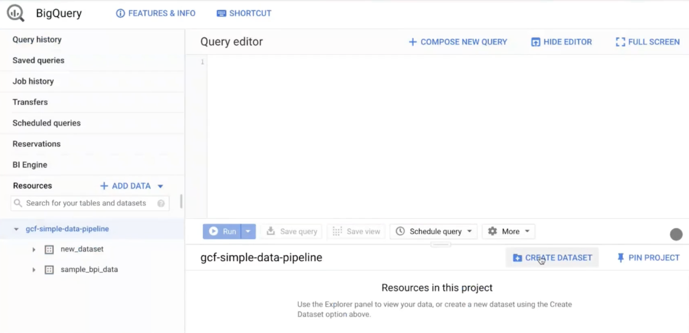
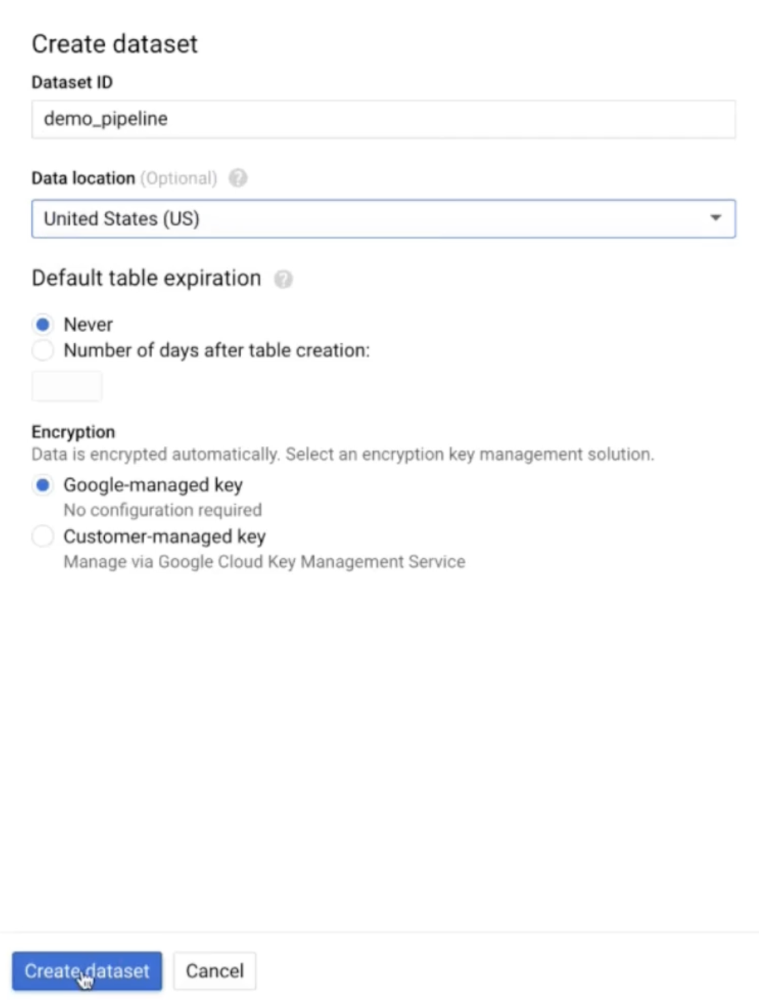
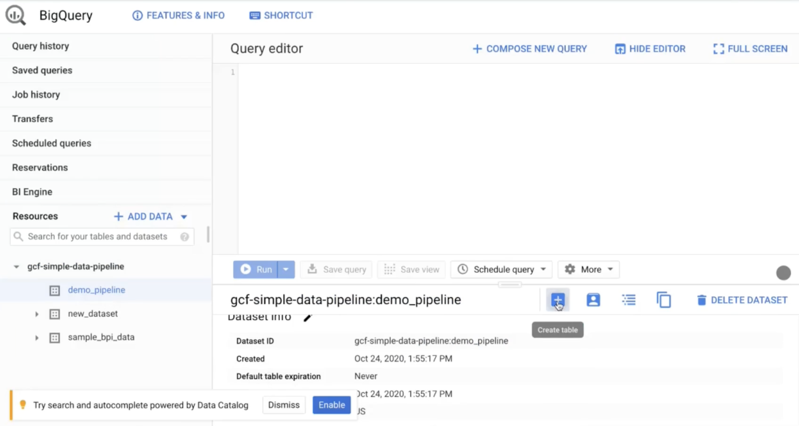
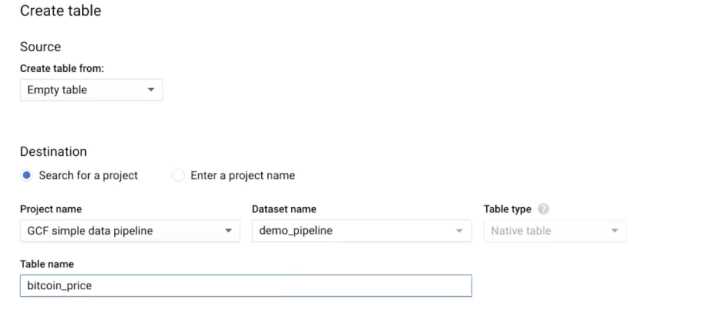
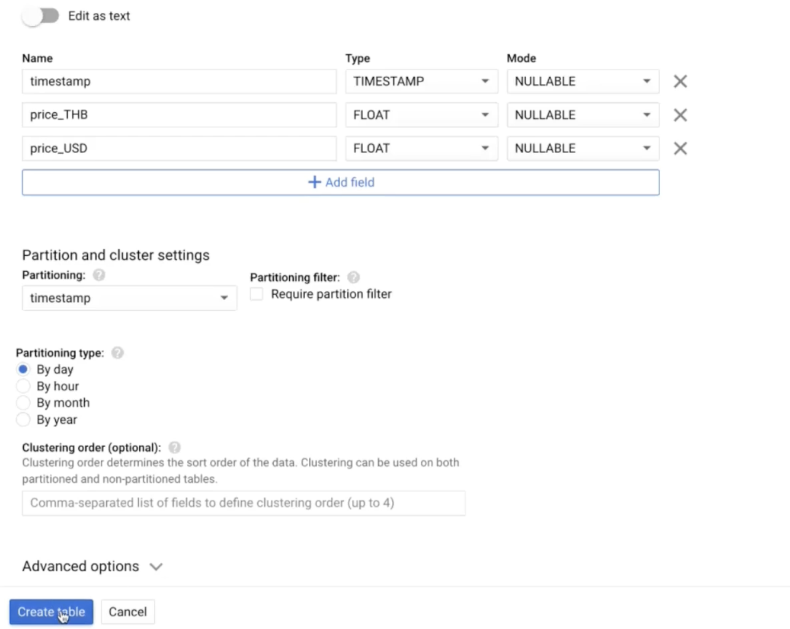

# BigQuery
## create dataset

## create table
Note: When creating a table, we need to know the columns in advance and be careful about the column order

## create done
We already have the dataset and table

## result
When the run is triggered, the result will be as follows

