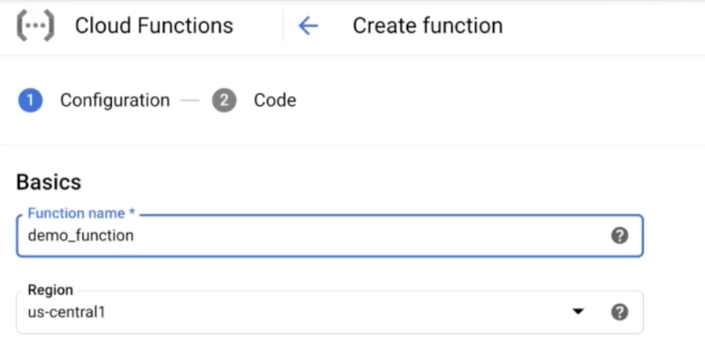
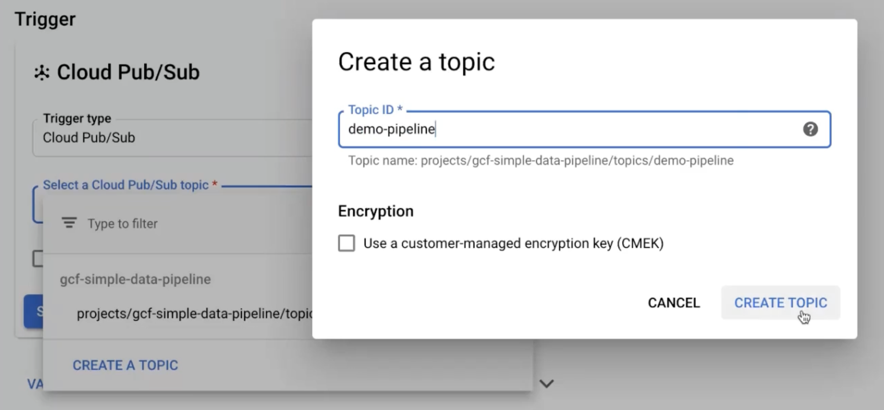
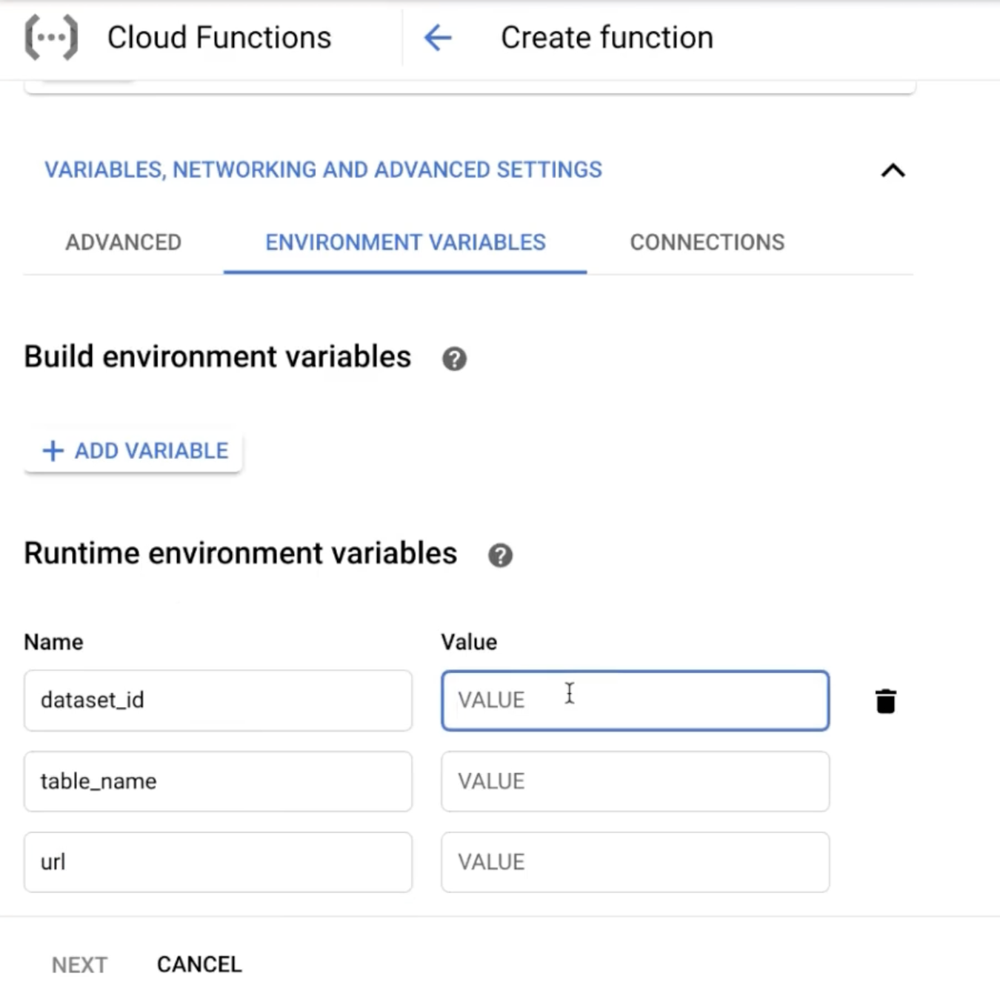

# Cloud Functions
## create cloud function




## create cloud pub/sub


## set environment variables


## add code
add code in requirements.txt
```sh
google-cloud-bigquery
requests
```


add code in main.py
```sh
import base64
import datetime
import os

import requests
from google.cloud import bigquery


class Config:
    dataset_id = os.environ.get("dataset_id")
    table_name = os.environ.get("table_name")
    url = os.environ.get("url")


def get_data(url: str) -> dict:
    """Get data via REST API call using requests package

    Args:
        url (str): The URL of target endpoint.
    
    Returns:
        Dictionary of API response
    """
    response = requests.get(url)
    return response.json()


def insert_data(event, context):
    """Background Cloud Function to be triggered by Pub/Sub.
    Args:
         event (dict): The dictionary with data specific to this type of event.
         context (google.cloud.functions.Context): The Cloud Functions event metadata.
    """
    client = bigquery.Client()
    dataset_ref = client.dataset(Config.dataset_id)

    raw = get_data(Config.url)
    record = [(
        raw["time"]["updatedISO"], 
        raw["bpi"]["THB"]["rate_float"], 
        raw["bpi"]["USD"]["rate_float"]
        )]
    
    table_ref = dataset_ref.table(Config.table_name)
    table = client.get_table(table_ref)
    result = client.insert_rows(table, record)
    return result
```


## create done


cloud function details


## result
When the run is triggered, the result will be as follows

