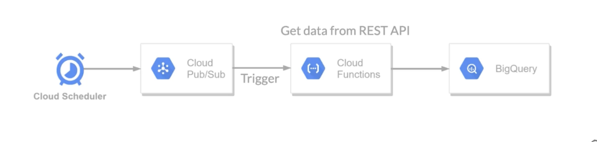

# streaming-insert-cloud-functions-to-bigquery
Cloud Functions streaming insert to BigQuery (with Cloud Pub/Sub trigger). In this project, the function will make a REST API call to get a data and insert to BigQuery.

---

## Project Overview

---

## Steps to run

1. Create BigQuery table with a proper schema (using Google Cloud Console).
2. Create a Pub/Sub topic. When deploy Cloud Functions via Console (web UI), there is a button to create a topic.
3. Deploy Cloud Function. 
4. Set Cloud Scheduler.

---

## Reference
- Google Cloud Functions example: https://github.com/GoogleCloudPlatform/python-docs-samples/blob/master/functions/helloworld/main.py